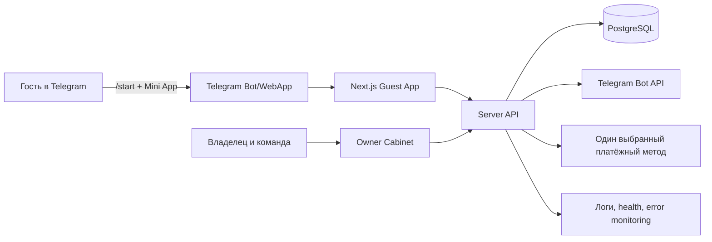

# Аудит платформы MOO перед офлайн-пилотом

**Роль:** бизнес- и системный аналитик  
**Дата аудита:** 19 августа 2026 года  
**Аудируемая версия:** `db570ad` (`Simplify owner dashboard layout with task inbox and quick toggles`)  
**Источники:** репозиторий [Moo Platform][1] и лендинг [MOO][2]

## 1. Executive summary

MOO уже является не прототипом экрана, а рабочим вертикальным продуктом с несколькими связанными контурами: Telegram Mini App для гостя, личный кабинет ресторана, меню и магазин, корзина, заказ, доставка, уведомления в Telegram, CRM-события, кампании и подписочные сущности в базе данных. Основной MVP-контур «гость → корзина → checkout → заказ → обработка в кабинете → уведомления» в коде присутствует.

При этом проект **ещё нельзя считать готовым к автономному офлайн-тесту с реальным рестораном без подготовительного hardening-цикла**. Главный разрыв находится не в количестве экранов, а в эксплуатационной целостности: отсутствует автоматический тестовый контур, в репозитории нет тестовых сценариев `*.test.*`/`*.spec.*`, документация по готовности частично устарела, проект зависит от корректной настройки Telegram webhook и environment secrets, а маркетинговые обещания лендинга шире, чем подтверждённый MVP в README/FEATURES.

Моя оценка текущей готовности к пилоту — **примерно 65–75% по функциональной ширине и 40–55% по операционной доказанности**. Это не процент готовности к коммерческому запуску: без E2E-прогона, реального меню, реальных способов оплаты и процедуры восстановления данных цифра будет вводить в заблуждение. Реалистичный путь — не «доделать всё», а зафиксировать пилотный scope, закрыть P0-блокеры, провести controlled pilot на одном ресторане и только после этого расширять B2B-функции.

> **Рекомендация:** запускать не публичный релиз, а ограниченный пилот на одном заведении с одним ботом, одной валютой, одной схемой доставки, ручным подтверждением оплаты и заранее подготовленным runbook для владельца и команды.

## 2. Что фактически есть в репозитории

| Контур | Подтверждённое состояние | Оценка для пилота |
|---|---|---|
| Guest Mini App | Главная, меню, магазин, корзина, checkout, профиль, история заказов, подписочные страницы | Функционально близко к пилоту; требуется E2E-проверка |
| Меню | Категории, блюда, опции/модификаторы, доступность, CSV import/export, изображения | Можно использовать после загрузки реального меню и проверки стоп-листа |
| Магазин | Категории, товары, варианты, цены и количества | Годится только если ресторан действительно продаёт магазинные позиции; иначе отключить |
| Заказы | Создание, серверный пересчёт позиций и суммы, delivery quote, pickup, промо, статусы, история | P0-контур; проверить гонки, повторную отправку и ручные переходы статусов |
| Доставка | Зоны, стоимость, минимальный чек, окно доставки, серверная проверка зоны | Есть основа; нужны реальные геозоны, SLA и аварийный сценарий |
| Оплата | QR-методы с ожиданием чека, Stripe intent/webhook, конфигурируемые способы оплаты | Для первого пилота выбрать один метод и не включать неподтверждённые методы |
| Telegram | Проверка Telegram Mini App `initData`, webhook, исходящие уведомления и ссылки на Mini App | P0: без webhook и правильного URL воронка `/start` не работает |
| Личный кабинет | Настройки заведения, меню/магазин, заказы, доставка, баннеры, кампании, команда, подписки, визиты | Широкий контур; требуется role-by-role smoke test |
| Подписки | База, планы, правила, визард, расчёт, доставки и CRM-представления присутствуют; пользовательский MVP в документации отключён | Не смешивать в первом пилоте с одноразовым заказом без отдельной приёмки |
| CRM/маркетинг | Визиты, лиды, кампании, ручные сценарные уведомления, owner inbox | Функциональная основа есть; автоматические anti-spam и conversion controls не закрыты |
| B2B/multi-tenant | Есть сущности Restaurant, RestaurantMember, BotIntegration и startParam; в документации зафиксирован single-tenant production behavior | Для одного ресторана приемлемо; настоящий multi-tenant запуск не доказан |

Архитектурно проект использует Next.js App Router, server API routes, Prisma и PostgreSQL. Данные гостя и владельца проходят через внутренние API, сервер обращается к базе через Prisma, а Telegram используется как входящий webhook и канал уведомлений. В авторизации реализована криптографическая проверка Telegram `initData`; при этом выбор ресторана в текущей логике всё ещё имеет single-tenant/fallback-ветки, поэтому перед B2B-масштабированием потребуется отдельная tenant-isolation приёмка.

## 3. Открытые кейсы и разрывы

### P0 — блокеры до офлайн-пилота

| ID | Открытый кейс | Почему критично | Критерий закрытия |
|---|---|---|---|
| P0-01 | Нет подтверждённого E2E smoke-прохождения на чистом окружении | Существующие документы содержат ручные чек-листы, но в репозитории не обнаружены автоматические тесты | Один воспроизводимый прогон на staging с сохранённым результатом по guest, owner и Telegram |
| P0-02 | Не доказан полный Telegram onboarding | В checklist прямо указано, что без `setWebhook` `/start` не отвечает | `/start` → кнопка Mini App → валидная авторизация → первый экран ресторана |
| P0-03 | Не зафиксирован единственный платёжный сценарий пилота | Лендинг заявляет QR, Stars и Omise, код также содержит QR/Stripe; разные методы имеют разную операционную модель | В пилотном runbook выбран один метод, пройден happy path, отказ, повтор и ручное подтверждение |
| P0-04 | Не проведён реальный order operations test | Нужна проверка не только создания заказа, но и действий кухни/менеджера/курьера | Заказ проходит все разрешённые статусы, клиент получает корректные уведомления, отмена и ошибка не ломают очередь |
| P0-05 | Не проверены env, webhook secrets, storage и production DB migration | Для рабочего ресторана отсутствие одной переменной превращается в неработающий контур | Заполнен environment matrix, миграции применены на копии БД, secrets проверены, есть rollback/backup процедура |
| P0-06 | Не установлен пилотный tenant и правила доступа | Single-tenant fallback удобен для MVP, но опасен при неверном `restaurantId` или приглашении сотрудника | В БД ровно один пилотный ресторан, все роли видят только разрешённые данные, несуществующий tenant не даёт доступ |
| P0-07 | Нет операционного runbook и владельца инцидента | Реальный ресторан будет работать вне команды разработки | Назначены owner, backup contact, часы поддержки, процедура ручного заказа и восстановления после сбоя |

### P1 — критичные кейсы первой пилотной недели

| ID | Открытый кейс | Что проверить или доделать |
|---|---|---|
| P1-01 | Реальное меню и цены | Импорт CSV, фото, эмодзи, описания, модификаторы, доступность, валютная точность, отображение пустых категорий |
| P1-02 | Stop-list и недоступность позиции | Позиция должна исчезать или блокироваться одинаково в меню, корзине и серверном POST заказа |
| P1-03 | Повторная отправка checkout | Проверить `clientRequestId`, двойной тап, refresh, возврат после Telegram/платёжного шага и повтор webhook |
| P1-04 | Ошибки доставки | Адрес вне зоны, минимальный чек, pickup, бесплатная доставка, отсутствие активных зон, неверные координаты |
| P1-05 | Уведомления | Создание заказа, изменение статуса, чек, подписочный лид, назначение команды; проверить отсутствие дубликатов |
| P1-06 | Роли команды | OWNER, ADMIN, STAFF и роли кухни/курьера, заявленные лендингом; проверить минимально необходимые права |
| P1-07 | Закрытие ресторана | Быстрый toggle open/closed должен одинаково влиять на guest flow и кабинет; проверить уже открытый checkout |
| P1-08 | Наблюдаемость | Логи ошибок, client error, version endpoint, health/menu health, уведомление о падении webhook и payment callback |
| P1-09 | Backup и восстановление | Бэкап БД, проверка восстановления на копию, экспорт меню, повторное подключение Telegram webhook |
| P1-10 | Соответствие лендингу | До запуска либо реализовать, либо явно ограничить claims по Stars/Omise, CRM automation, push, 48-hour launch и subscription checkout |

### P2 — после успешного пилота

К P2 относятся полноценный multi-tenant B2B, самостоятельный onboarding нескольких ресторанов, единый конструктор опций menu/store, автоматические anti-spam cooldown и daily caps для scenario notifications, click/conversion tracking, полноценная подписочная коммерция с recurring payment, промокоды и loyalty, отзывы, расширенная аналитика, а также систематизация UI-стандартизации. Эти задачи важны для платформы, но не должны блокировать первый контролируемый ресторанный запуск.

## 4. Несоответствия между лендингом и фактическим scope

| Обещание лендинга | Фактический риск/разрыв | Решение до пилота |
|---|---|---|
| «Запуск за 48 часов» | Возможно только при заранее подготовленном меню, фото, Telegram-боте и одном платёжном сценарии | Переформулировать во внутренний SLA: «при готовых исходных данных» |
| «Подписки на обеды и рационы с календарём» | В README/FEATURES клиентские подписки обозначены как выключенный MVP/заглушка, несмотря на развитые серверные и owner-сущности | Либо включить отдельным beta-флагом после приёмки, либо убрать обещание из пилотного оффера |
| «Stars · QR · Omise» | В коде явно присутствуют QR и Stripe-контуры; наличие полноценного Omise/Stars production flow этим аудитом не подтверждено | В пилоте оставить только реально проверенный метод; claims сделать условными |
| «CRM и push» | Визиты, кампании и ручные scenario messages есть; anti-spam и conversion tracking ещё обозначены как next step | Называть текущий контур owner-triggered Telegram outreach, а не полностью автоматическим CRM |
| «Роли Повар, Курьер, Менеджер» | В модели есть ресторанные роли, но сквозное право каждой операционной роли необходимо доказать отдельными тестами | Составить role-permission matrix и выдать только минимальные права |
| «Управление стоп-листами в один клик» | В коде есть проверки доступности, но UX и поведение stop-list надо проверить на всем пути заказа | Сделать отдельный smoke test и добавить явный статус позиции в кабинете |

## 5. Главные системные риски

**Tenant isolation.** В проекте есть `Restaurant`, `RestaurantMember`, `BotIntegration` и start parameters, но одновременно сохраняется single-tenant runtime с fallback на pinned/default restaurant. Для одного пилотного ресторана это допустимый режим, однако любая ошибка в выборе контекста может привести к показу чужого меню или доступу сотрудника не к тому заведению. До B2B-масштабирования нужен обязательный тест на cross-tenant reads/writes для каждого API admin и consumer.

**Операционная целостность заказа.** Сервер пересчитывает trusted items и subtotal, проверяет доставку, способ оплаты и mismatch суммы, а также поддерживает client request id. Это сильная сторона реализации. Но реальный риск остаётся в переходах статусов, повторных запросах, webhook idempotency и согласованности Telegram-сообщения с фактическим состоянием БД. Эти сценарии нельзя закрыть только визуальной проверкой.

**Платёжный контур.** QR с ожиданием чека — это не то же самое, что подтверждённая онлайн-оплата. Для ресторана нужен явный state machine: order created, payment pending, receipt uploaded, payment confirmed/rejected, order accepted/cancelled. Нельзя одновременно обещать полностью автоматическую оплату и использовать ручную проверку чека без явного обозначения этого процесса.

**Конфигурация и деплой.** В старой документации отмечено `typescript.ignoreBuildErrors: true` как workaround для Vercel. Даже если текущий production build проходит, этот флаг следует убрать или заменить на контролируемый CI gate до масштабирования. `npm ci` в текущей sandbox-среде не завершился в отведённое время на сетевой установке, поэтому я не засчитываю локальный lint/type-check/build как подтверждённые результаты; это отдельный открытый блокер воспроизводимости.

**Данные и восстановление.** В продукте много настроек, которые живут в БД: меню, зоны, баннеры, campaigns, payment methods, roles, subscriptions и BotIntegration. Для ресторанного пилота backup должен быть не абстрактным обещанием, а проверенным восстановлением на отдельной БД с фиксацией времени и потери данных.

## 6. Целевая схема пилотного контура

В пилоте следует оставить один ресторан, один Telegram-бот, одну валюту, одну активную схему fulfilment либо две явно протестированные схемы delivery/pickup, а также один платёжный метод. Все дополнительные сущности можно сохранить в базе, но не включать в гостевой интерфейс без приёмки.

## 7. Критерии Go/No-Go

| Область | Go-критерий |
|---|---|
| Onboarding | `/start` и открытие Mini App проходят с реальным Telegram-пользователем, авторизация валидируется сервером |
| Каталог | Реальное меню загружено, цены и доступность совпадают с согласованным source of truth |
| Checkout | Двойная отправка не создаёт дубли, серверная сумма совпадает с UI, недоступные позиции блокируются |
| Оплата | Избранный метод пройден в happy path и в отказе; статус оплаты понятен оператору и гостю |
| Доставка | Проверены зона, min order, fee, window, pickup и адрес вне зоны |
| Operations | Сотрудник без разработки принимает, готовит, передаёт и закрывает заказ |
| Notifications | Клиент и команда получают сообщения без утечки токенов и без критических дублей |
| Access control | Роли не видят лишние разделы и данные; cross-tenant test отрицательный |
| Recovery | Есть backup, restore drill, экспорт меню и ручная процедура работы при недоступности приложения |
| Support | Есть ответственный, журнал инцидентов и ежедневный review KPI пилота |

## 8. Итоговая рекомендация

Платформу следует доводить до пилота через **вертикальный срез**, а не через расширение всех функций. Сначала необходимо доказать один безупречный сценарий реального ресторана: гость открывает Mini App из Telegram, видит актуальное меню, создаёт заказ, оплачивает выбранным способом или прикладывает чек, менеджер подтверждает и меняет статус, кухня и доставка выполняют операцию, а гость получает финальное уведомление. После этого можно включать подписки, CRM-автоматику и multi-tenant onboarding.

**Решение по текущему состоянию:** условный `NO-GO` для открытого коммерческого запуска и `GO WITH CONDITIONS` для закрытого технического пилота после закрытия P0-01…P0-07.

## References

[1]: https://github.com/viktorsabai/moo_platform "Moo Platform repository"
[2]: https://moo-beryl.vercel.app/ "MOO restaurant Telegram Mini App landing page"
