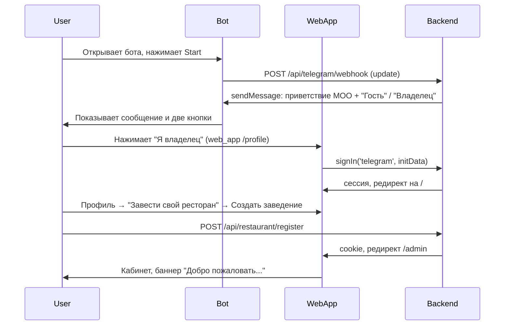

# Онбординг владельца (MOO box)

Логика сквозная: без моков в ключевых потоках. Платформа MOO (B2B2C): заведения (B) подключаются к платформе и обслуживают гостей (C). Первый заказчик коробки может завести свой ресторан двумя способами.

---

## Полный путь первого входа нового владельца (бот → кабинет)

1. Пользователь открывает бота (ссылку или поиск), нажимает **Start** → бот отвечает приветствием платформы MOO и **двумя кнопками: «Я гость» / «Я владелец»**.
2. **Владелец:** нажимает «Я владелец» → открывается mini app (например `/profile`) → автоматически выполняется вход через Telegram при необходимости и редирект на главную или профиль. **Гость:** нажимает «Я гость» → открывается главная/меню заведения.
3. **Владелец (продолжение):** Профиль → «Завести свой ресторан» → «Создать заведение» → форма название/код → `POST /api/restaurant/register` → редирект в `/admin` с баннером онбординга «Добро пожаловать…».

**Альтернативный сценарий (MOO создал заведение и дал ссылку):** владелец открывает ссылку с `startapp=<startParam>` → mini app в контексте заведения → Профиль → «Войти в кабинет».

---

## Сценарий A: MOO создаёт заведение

1. В платформе (`/platform`, только для SUPERADMIN) создаётся ресторан: название, slug, startParam, опционально бот и Telegram ID владельца.
2. Владельцу выдаётся ссылка/QR с `startParam` этого заведения.
3. Владелец открывает приложение по ссылке → попадает в контекст своего ресторана → **Профиль** → «Режим владельца» → «Войти в кабинет».
4. В кабинете один раз показывается баннер: «Добро пожаловать в кабинет. Начните с настройки заведения → добавьте товары → подключите бота для QR.» Дальше — инлайн подсказки и empty-state в разделах.

**Шаги онбординга владельца (после входа в кабинет):**

- Настройки заведения → чек-лист (бот, часы, доставка, товары, команда), форма доставки и часов, ссылка на магазин.
- Меню и товары → добавить первый товар (empty-state с CTA).
- Команда → добавить сотрудника по Telegram ID.
- Заказы → просмотр заказов заведения (empty-state, пока заказов нет).
- QR/бот → страница с ссылкой и QR для гостей.

---

## Сценарий B: Самообслуживание (создать своё заведение)

1. Пользователь без роли владельца видит в **Профиле** блок «Завести свой ресторан» с кнопкой «Создать заведение».
2. По нажатию — переход на `/profile/restaurant/new`: форма «название» и «код (латиница)».
3. Отправка `POST /api/restaurant/register` → создаётся заведение, бот-интеграция (startParam = slug), текущий пользователь становится OWNER; в ответ устанавливается cookie контекста заведения.
4. Редирект в кабинет `/admin` — тот же баннер «Добро пожаловать…» и дальше инлайн/empty-state онбординг.

---

## Конфигурация

- **URL платформы (один «сайт»):** `APP_URL` или `NEXTAUTH_URL` — публичный URL **этой одной** платформы (например `https://your-app.vercel.app`). Нужен для: mini app (кнопки «Открыть приложение» в боте), webhook Telegram, редиректы с десктопа в Telegram, NextAuth callback.
- **Демо-бот (вне контекста заведения):** `NEXT_PUBLIC_DEMO_BOT`, `NEXT_PUBLIC_DEMO_STARTAPP` (по умолчанию `topka_demo_bot`, `topka`). Используется для ссылок «открыть в Telegram» на профиле и страницах входа/регистрации.
- **Webhook бота (приветствие MOO + «Я гость» / «Я владелец»):** после деплоя один раз вызвать `setWebhook`: `POST https://api.telegram.org/bot<BOT_TOKEN>/setWebhook?url=https://<APP_URL>/api/telegram/webhook`. См. PRE_DEPLOY_CHECKLIST.md.
- **Меню и подписки:** данные берутся из API заведения (store products); моки не используются в сценарии «первый заказчик коробки».

---

**Последнее обновление:** 2026-01-28
